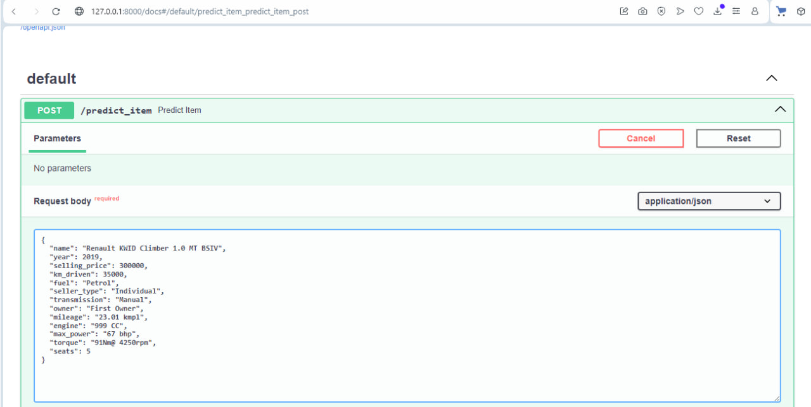
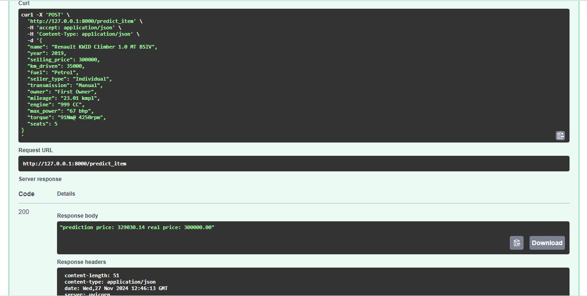
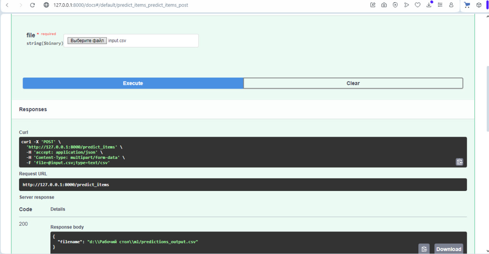

# AI_HW1_Regression_with_inference_base

Файл **AI_HW1_Regression_with_inference_pro_(1).ipynb** содержит анализ данных и реализацию регрессионных моделей для предсказания стоимости автомобилей.

В ходе экспериментов данные были нормализованы с использованием метода **StandardScaler**. Результаты показали, что нормализация незначительно влияет на качество модели по сравнению с обычной линейной регрессией без нормализации, однако она улучшает интерпретацию весов признаков. Чем больше по модулю коэффициент βi, тем важнее соответствующий признак.

На этапе EDA для первичного анализа данных был построен **YData Profiling** дашборд, который предоставил подробные визуализации и статистику по набору данных. Это помогло выявить важные закономерности и глубже понять данные.

В процессе анализа был выполнен **GridSearch** для подбора гиперпараметров моделей **Lasso**, **ElasticNet** и **Ridge**. Это позволило найти оптимальные параметры для каждой из моделей. Однако **Lasso** и **ElasticNet** не улучшили значение R^2, **Lasso** не занулило ни одного коэффициента.

Также было установлено, что предобработка категориальных признаков значительно повышает точность модели. Столбец **name** был обработан с использованием **Target Encoding**, а другие категориальные столбцы — методом **OneHot-кодирования**. Модель **Ridge** с параметрами alpha = 0.1, max_iter = 50 после добавления категориальных переменных показала значительное улучшение качества модели: R^2_train = 0.97, R^2_test = 0.89, что может свидетельствовать о переобучении (вероятно, из-за использования **Target Encoding**).

Реализованная бизнес-метрика показала, что **Ridge** регрессия дает наибольший процент прогнозов, отклоняющихся от реальных цен на автомобили не более чем на 10%.

# FastAPI

Был реализован сервис на **FastAPI**, который предоставляет две основные функции для пользователя:
- На вход подаются признаки одного объекта в формате **JSON**, на выходе сервис возвращает предсказанную стоимость автомобиля.
- На вход подается **CSV**-файл с признаками тестовых объектов, на выходе получаем файл с дополнительным столбцом, содержащим предсказания для этих объектов.

В папке **inference** находится код приложения на FastAPI, а также файлы модели и информацию для предобработки данных.

Приложение было протестировано через документацию **Swagger** на корректность работы:

- На фото 1 приведен пример запроса через **JSON**-файл, на фото 2 — полученный ответ.
- На фото 3 показан пример запроса **CSV**-файла **input.csv**, а также ответ, подтверждающий, что файл был загружен в папку **ml** на рабочем столе.
- Выгруженный файл **predictions_output** находится в папке **inference**.

Фото 1

Фото 2

Фото 3

